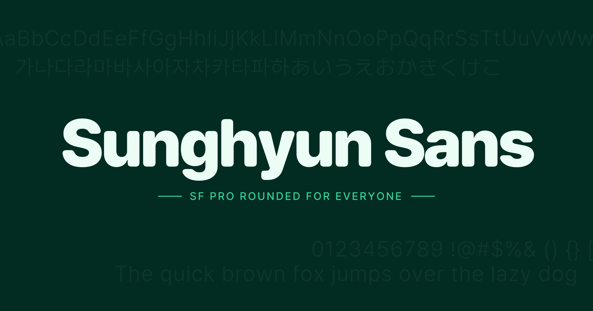

<p align="center">
  
</p>

<p align="center">
  An open-source rounded typeface — SF Pro Rounded for everyone.<br>
  Supports Latin, Cyrillic, Greek, Vietnamese, Korean, Japanese, and Chinese across 9 weights.
</p>

<p align="center">
  <a href="https://sans.cho.sh">Website</a> &middot;
  <a href="https://github.com/anaclumos/sunghyun-sans/tree/main/release">Download</a> &middot;
  <a href="LICENSE">SIL Open Font License</a>
</p>

## Font Families

| Family | Script Support | Glyphs | Font Name |
|--------|---------------|--------|-----------|
| Sunghyun Sans | Latin, Cyrillic, Greek, Vietnamese | ~3,190 | `Sunghyun Sans` |
| Sunghyun Sans KR | Korean + Latin | ~14,716 | `Sunghyun Sans KR` |
| Sunghyun Sans JP | Japanese + Latin | ~22,926 | `Sunghyun Sans JP` |
| Sunghyun Sans Disambiguated | Korean + Japanese + Latin | ~23,400 | `Sunghyun Sans Disambiguated` |

## Weights

All families support 9 weights:

| Weight | Value |
|--------|-------|
| Thin | 100 |
| ExtraLight | 200 |
| Light | 300 |
| Regular | 400 |
| Medium | 500 |
| SemiBold | 600 |
| Bold | 700 |
| ExtraBold | 800 |
| Black | 900 |

## Formats

- **OTF** — `fonts/otf/`
- **TTF** — `fonts/ttf/`
- **WOFF2** — `dist/web/` (for web embedding)

Pre-built archives are available in the [`release/`](release/) directory.

## OpenType Features

Sunghyun Sans includes built-in OpenType features:

| Feature | Description |
|---------|-------------|
| `tnum` | Tabular numbers |
| `zero` | Slashed zero |
| `frac` | Fractions |
| `subs` | Subscript |
| `case` | Case-sensitive forms |
| `salt` | Stylistic alternates |
| `ordn` | Ordinals |
| `calt` | Contextual alternates |
| `ss01`–`ss16` | Stylistic sets (straight 6/9, open 4, centered colon, Korean localization, etc.) |
| `cv01`–`cv13` | Character variants |

```css
/* Example: enable tabular numbers and slashed zero */
font-feature-settings: "tnum" 1, "zero" 1;
```

## Web Embedding (CDN)

The easiest way to use Sunghyun Sans on the web is via the jsDelivr CDN.

### Quick Start

Add the stylesheet to your HTML `<head>`:

```html
<link rel="stylesheet" href="https://cdn.jsdelivr.net/gh/anaclumos/sunghyun-sans@latest/dist/web/css/sunghyun-sans-kr-dynamic-subset.min.css" />
```

Then use the font in your CSS:

```css
body {
  font-family: 'Sunghyun Sans KR', sans-serif;
}
```

### Available CSS Files

All CSS files are served from:

```
https://cdn.jsdelivr.net/gh/anaclumos/sunghyun-sans@latest/dist/web/css/
```

| Family | Full | Dynamic Subset (Recommended) |
|--------|------|---------------------------|
| Sans | `sunghyun-sans.min.css` | `sunghyun-sans-dynamic-subset.min.css` |
| KR | `sunghyun-sans-kr.min.css` | `sunghyun-sans-kr-dynamic-subset.min.css` |
| JP | `sunghyun-sans-jp.min.css` | `sunghyun-sans-jp-dynamic-subset.min.css` |
| Disambiguated | `sunghyun-sans-disambiguated.min.css` | `sunghyun-sans-disambiguated-dynamic-subset.min.css` |

### Full vs Dynamic Subset

- **Full** loads the entire font file for each weight. Suitable for Latin-only usage where font files are small.
- **Dynamic Subset** (recommended for CJK) splits each font into small chunks using `unicode-range`. The browser only downloads the characters actually needed on the page. This dramatically reduces initial load time for Korean and Japanese fonts.

### Using Multiple Families

```html
<link rel="stylesheet" href="https://cdn.jsdelivr.net/gh/anaclumos/sunghyun-sans@latest/dist/web/css/sunghyun-sans-dynamic-subset.min.css" />
<link rel="stylesheet" href="https://cdn.jsdelivr.net/gh/anaclumos/sunghyun-sans@latest/dist/web/css/sunghyun-sans-kr-dynamic-subset.min.css" />
```

```css
body {
  font-family: 'Sunghyun Sans KR', 'Sunghyun Sans', sans-serif;
}
```

## Installation

### Nix

Sunghyun Sans is packaged as a Nix flake:

```nix
# flake.nix
{
  inputs.sunghyun-sans.url = "github:anaclumos/sunghyun-sans";

  # Use the overlay
  nixpkgs.overlays = [ sunghyun-sans.overlays.default ];
}
```

Available packages: `sunghyun-sans`, `sunghyun-sans-kr`, `sunghyun-sans-jp`, `sunghyun-sans-disambiguated`, and `default` (all families).

### Self-Hosting

Download the `dist/web/` directory from this repository and serve it from your own infrastructure. The CSS files use relative paths to reference font files, so the directory structure must be preserved.

## Building from Source

```bash
# Install dependencies
uv sync

# Build web distribution (CSS + woff2 + dynamic subsets)
uv run python scripts/build-web-dist.py
```

## Project Structure

```
fonts/
  otf/          # OpenType font files
  ttf/          # TrueType font files
dist/
  web/
    css/        # Web CSS (full + dynamic subset, minified + unminified)
    woff2/      # Web font files
release/        # Pre-built archives (OTF, TTF, Web per family)
scripts/        # Build scripts
site/           # Showcase website (sans.cho.sh)
```

## License

Sunghyun Sans is licensed under the [SIL Open Font License 1.1](LICENSE).

- Use in personal and commercial projects
- Embed on websites via CSS `@font-face`
- Bundle with applications and software
- Modify and create derivative fonts
- Redistribute freely

Restrictions: cannot sell font files standalone, derivatives must remain under OFL, don't use the reserved font name for modified versions.

## Credits

Sunghyun Sans is based on:

- [Inter](https://github.com/rsms/inter) by Rasmus Andersson
- [Pretendard](https://github.com/orioncactus/pretendard) by Kil Hyung-jin
- [Source Han Sans](https://github.com/adobe-fonts/source-han-sans) by Adobe
- [M PLUS 1p](https://github.com/coz-m/MPLUS_FONTS) by Coji Morishita

See [CONTRIBUTORS.txt](CONTRIBUTORS.txt) for details.
